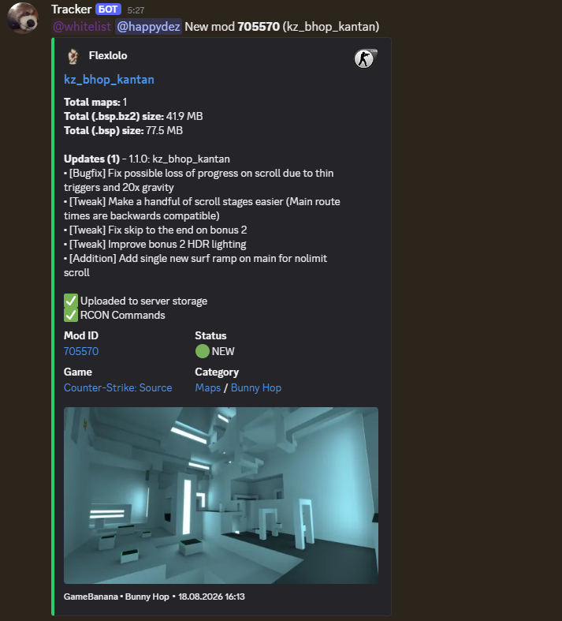
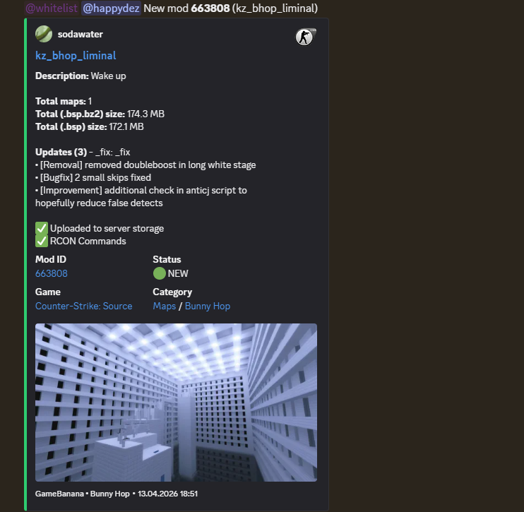
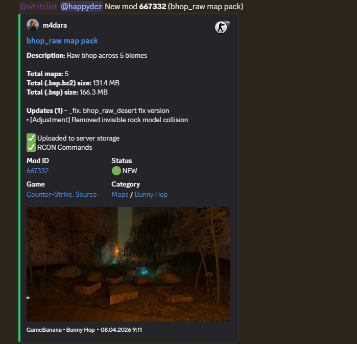

# gb-tracker

Watches GameBanana categories and announces new and updated mods.

Every mod it finds is also published as an event, so you can hook up your own
service and do something with it. A working example of that is
[`services/gb-mms`](services/gb-mms), which downloads the maps and puts them on
a game server.

## Quick start

Needs Docker Compose.

```sh
git clone https://github.com/happydez/gb-tracker
cd gb-tracker

cp .env.example .env                        # webhooks, uid/gid
cp config.example.yaml config.yaml          # what to watch
cp notifier.example.yaml notifier.yaml      # where to post

mkdir data                                  # default path for the database

docker compose up -d
```

Go through the three files you copied before starting:

- `.env` holds the webhook urls and `GB_UID`/`GB_GID`, which should match your
  own `id -u` and `id -g`
- `config.yaml` lists the categories to watch, the poll interval and
  `ts_init`, a unix timestamp that keeps the first poll from announcing
  everything the category already has
- `notifier.yaml` sets up the channels and what gets posted to them

Create `data/` yourself too, otherwise Docker makes it owned by root and the
tracker cannot write there.

## Writing your own service

A separate program with its own compose file. It joins the `gbtracker` network
and subscribes to what it needs. Nothing in this repo has to change.

```sh
go get github.com/happydez/gb-tracker
```

Subjects:

| Subject | | Payload |
| --- | --- | --- |
| `mods.discovered` | subscribe | `ModDiscovered` |
| `notifications.send` | publish | `Notification` |
| `errors.<service>` | publish | `ErrorEvent` |

Payloads are in [`pkg/events`](pkg/events/payloads.go), the NATS client in
[`pkg/bus`](pkg/bus/bus.go).

```go
b, err := bus.Connect(ctx, bus.DefaultConfig(), log)
if err != nil {
    return err
}
defer b.Close()

// The durable name is your cursor. Pick one nobody else uses, or you and the
// other service will split the stream instead of both seeing everything.
cfg := bus.DefaultConsumerConfig("my-service", "mods.discovered")

sub, err := b.Subscribe(ctx, cfg, func(ctx context.Context, ev events.Event) error {
    if ev.Type != events.TypeModDiscovered {
        return nil
    }

    mod, err := events.DataOf[events.ModDiscovered](ev)
    if err != nil {
        // Retrying will not fix a payload that does not decode.
        return fmt.Errorf("%w: decode mod: %w", bus.ErrTerminal, err)
    }

    return handle(ctx, mod)
})
```

A few rules:

- Return `nil` when you are done with the event, an error if it is worth
  retrying later, or `bus.ErrTerminal` to give up on it for good.
- To post something, publish an `events.Notification` on `notifications.send`
  and name the channel, for example `"public"`. Webhook urls stay in the
  notifier config, your service never sees them.
- Report failures as `errors.<your-service>` and the notifier puts them in the
  private channel.
- The same event can arrive more than once, so remember what you already did.
  Store `mod_id` with `mdate`, since the same mod comes back when it gets
  updated.


### gb-mms (movement maps)

Subscribes to `mods.discovered`, downloads the archive, unpacks it (including
nested archives), checks the `.bsp` files, sorts maps into folders by prefix,
uploads them over FTP, runs RCON commands, and posts the result.

<p></p>

<p></p>

<p></p>
